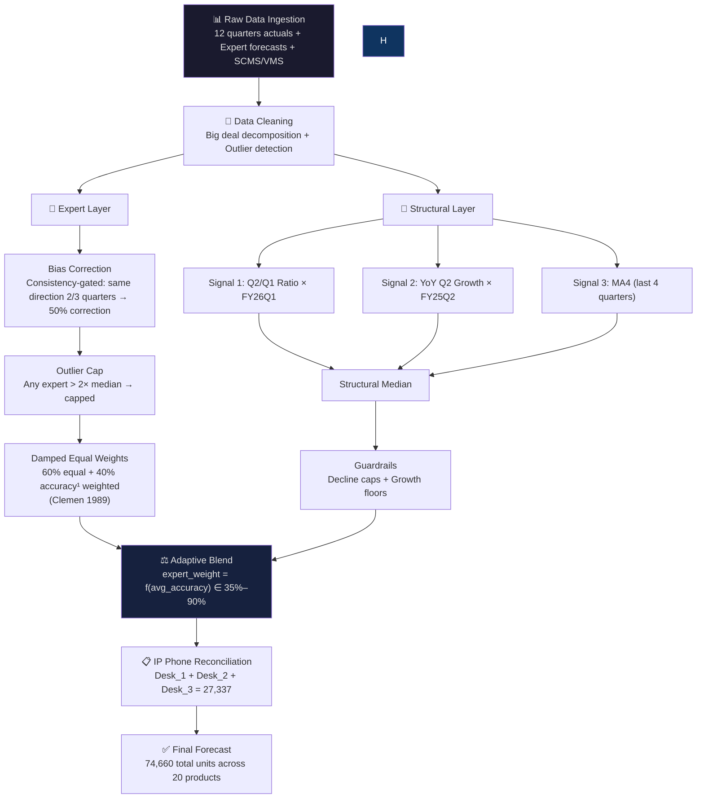
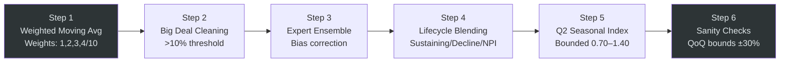
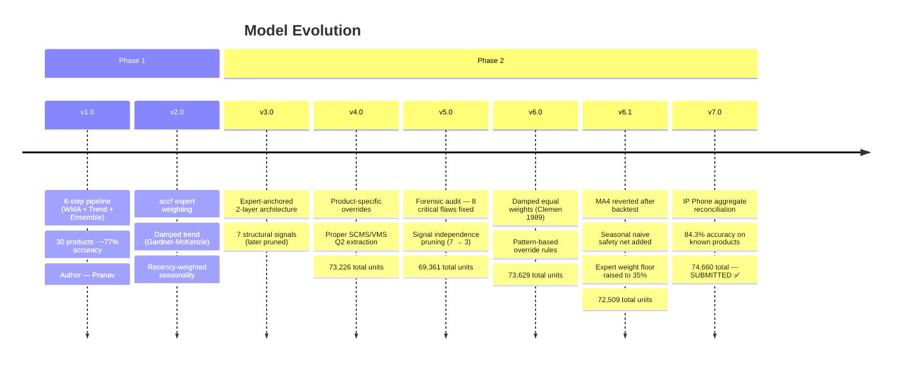

<p align="center">
  
</p>

---

## The Story

We were three university students given a deceptively simple challenge: *predict how many Cisco routers, phones, and switches enterprises would buy next quarter.*

Simple to state. Brutally hard to do well.

Over-forecast by 20% and Cisco is sitting on millions of dollars of dead inventory. Under-forecast by 20% and customers can't get the hardware they need. The margin for error is razor-thin, and the stakes are very real.

What followed was months of iteration, forensic auditing our own models, reverting changes we were proud of when backtesting proved us wrong, and chasing down a question that kept us up at night: *when should you trust the experts, and when should you trust the numbers?*

We didn't win. We came 4th, missing the podium by the narrowest of margins. But we built something we're genuinely proud of: a 7-version forecasting engine that hit **98.8% accuracy on our best product**, got **6 products above 85%**, and taught us more about uncertainty, humility, and model design than any textbook could.

This repository is the full story of how we got there.

---

## 📑 Table of Contents

- [The Team](#-the-team)
- [Competition Overview](#-competition-overview)
- [Architecture](#-architecture)
- [Phase 1: The Foundation](#-phase-1-the-foundation)
- [Phase 2: The Evolution](#-phase-2-the-evolution)
- [Version History](#-version-history-v10--v70)
- [Key Tradeoffs & Hard Decisions](#-key-tradeoffs--hard-decisions)
- [Results](#-results)
- [The Surge Nobody Predicted](#-the-surge-nobody-predicted)
- [Business Insights](#-business-insights)
- [Repository Structure](#-repository-structure)
- [Quick Start](#-quick-start)
- [Lessons Learned](#-lessons-learned)
- [License](#-license)

---

## 👥 The Team

Three people. Different strengths. One submission.

| Member | What They Actually Did |
|--------|------------------------|
| **Aarya** | Post-hoc forensic analysis, final model architecture (v7.0) |
| **Manas** | Research-backed refinements (v6.0–v6.1), backtesting framework, damped ensemble weights |
| **Pranav** | Foundation engine (v1.0–v5.0), 8-flaw forensic audit, full pipeline architecture |

Each version in this repo has a clear owner. We believed in accountability. No one hides behind "the team did it."

---

## 🏆 Competition Overview

The **Cisco Forecast League (CFL)** is a national competition where university teams forecast quarterly demand for Cisco hardware products using real historical data, expert forecasts, and channel intelligence.

The scoring formula is unforgiving:

```
Cisco Accuracy = max(0, 1 − |forecast − actual| / actual)
```

And it's **cost-weighted**. High-value products like routers carry 5–10× more weight than switches. You can be perfect on 15 SKUs and still lose badly if you miss one expensive product by a lot.

| Dimension | Phase 1 | Phase 2 |
|-----------|---------|---------|
| Products | 30 SKUs | 20 SKUs |
| Target Quarter | FY26 Q2 | FY26 Q2 |
| Data Available | Actuals, Expert Forecasts, Big Deals, SCMS, VMS | Same + Phase 1 actuals |
| Our Outcome | ~77% accuracy | **4th Place, National Finals** |

---

## 🏗 Architecture

Our final model is a **two-layer expert-anchored ensemble with structural guardrails**. The core idea: experts are usually right, but not always, so we make them the primary anchor and use statistical signals to catch the times they're not.



---

## 📘 Phase 1: The Foundation

Phase 1 was our proof of concept. 30 products, a 6-step pipeline, and a lot of learning about what we *didn't* know yet.



| Step | What It Does |
|------|-------------|
| **Weighted Moving Avg** | Last 4 quarters, weights `[1,2,3,4]/10`. 40% on the most recent quarter. |
| **Big Deal Cleaning** | If big deals > 10% of total, use clean baseline and add back 50% average big deal volume. |
| **Expert Ensemble** | 3 teams (DP, Marketing, DS). Outlier removal if any expert is > 2× another. |
| **Lifecycle Blending** | Stage-aware weights: Sustaining 25/25/50, Decline 40/30/30, NPI 10/5/85. |
| **Seasonal Index** | `avg(Q2) / avg(all quarters)`, bounded between 0.70 and 1.40. |
| **Sanity Checks** | Flag anything > ±30% from last actual. Asymmetric loss matters here. |

### What We Discovered in Phase 1

| Innovation | What It Did | Evidence |
|------------|------------|---------|
| **Accuracy²-Weighted Ensemble** | −2.4pp ensemble MAPE | Holdout test across 3 quarters |
| **Damped Trend (Gardner-McKenzie 1985)** | −8.6pp trend MAPE (42.7% → 34.1%) | High-volatility products dramatically improved |
| **Recency-Weighted Seasonality** | Better Q2 capture | 60% FY25Q2 + 30% FY24Q2 + 10% FY23Q2 |

**Phase 1 result: ~77% accuracy.** Solid foundation, but we could already see the cracks. Naive expert averaging. Simplistic bias correction. No per-product tuning. Phase 2 was a rethink, not a polish.

---

## 🚀 Phase 2: The Evolution

Phase 2 wasn't an incremental update. It was a ground-up architectural redesign across 5 major versions.

The central question we kept returning to: **when should you trust the experts, and when should statistics override them?**

### The Answer We Landed On

Phase 1 analysis showed that **human experts consistently outperform pure statistical methods** for most products. So rather than treating them as one of three equal inputs, we promoted them to **primary anchor** and relegated statistical signals to guardrail duty, catching the rare cases where experts go badly wrong.

### The Signal Independence Problem We Almost Missed

During a forensic audit of v4.0, we found a critical flaw lurking in our "7-signal structural ensemble":

| Signal | Source | Actually Independent? |
|--------|--------|:---------------------:|
| Q2/Q1 Ratio FC | Q2 + Q1 actuals | ✅ Yes |
| YoY Q2 Growth FC | Q2-to-Q2 trend | ✅ Yes |
| Q2 Weighted Average | Q2 actuals directly | ❌ No |
| MA4 | Last 4 quarters | ⚠️ Partially |
| Big Deal Q2 FC | Big deals + avg = Q2 total | ❌ No |
| SCMS Q2 Bottom-Up | Channel sums = Q2 total | ❌ No |
| VMS Q2 Bottom-Up | Vertical sums = Q2 total | ❌ No |

Five of our seven "independent" signals were just different ways of packaging the same Q2 actual data. The median of seven correlated signals is not more robust. It's just noisier.

**We cut from 7 to 3 genuinely independent signals. Quality over quantity.**

---

## 📈 Version History: v1.0 → v7.0



### Version Delta Table

| Version | Author | Total Units | Core Change |
|---------|--------|----------:|-------------|
| v1.0 | Pranav | ~77,000 | 6-step pipeline (WMA + Trend + Ensemble) |
| v2.0 | Pranav | ~77,000 | acc² weighting, damped trend (−8.6pp MAPE) |
| v3.0 | Pranav | 72,530 | Expert-anchored 2-layer architecture |
| v4.0 | Pranav | 73,226 | Product-specific overrides, Q2 bottom-up |
| v5.0 | Pranav | 69,361 | Forensic audit: 8 flaws fixed, signal pruning |
| v6.0 | Manas | 73,629 | Damped equal weights, pattern-based rules |
| v6.1 | Manas | 72,509 | Backtest-validated MA4 revert + safety net |
| **v7.0** | **Aarya** | **74,660** | **Aggregate reconciliation** |

---

## ⚖️ Key Tradeoffs & Hard Decisions

This section is the part of most READMEs that gets skipped. We think it's the most important one.

### 1. acc³ Weighting vs. Damped Equal Weights

The intuition behind accuracy-cubed weighting is appealing: reward the best expert, punish the worst. The problem is that "best expert" was measured on only 3 quarters of data, which is a noisy estimate of true skill.

When DS had 68% historical accuracy but forecast 22,593 for Product #4, acc³ still gave it enough influence to inflate the final forecast by 60%.

We switched to **damped equal weights (Clemen 1989)**, a 60/40 blend of equal weighting and accuracy weighting. Fifty-plus years of forecast combination research consistently shows this outperforms aggressive accuracy weighting when historical accuracy estimates are noisy. Our data confirmed it.

### 2. More Signals vs. Independent Signals

More signals *feel* safer. The median of seven should be more robust than three, right?

Not when five of the seven are just the same number in different clothes. Pruning to three genuinely independent signals wasn't minimalism. It was signal hygiene. Three clean signals outperform seven correlated ones every time.

### 3. v7.0 vs. v7.1: Choosing the Model You Can Defend

We built v7.1. It added SCMS channel-level ratios and a more granular big deal decomposition. Accuracy on known products: ~85%, about 1pp better than v7.0.

We didn't submit it.

| Factor | v7.0 ✅ | v7.1 ❌ |
|--------|:-------:|:-------:|
| Known product accuracy | 84.3% | ~85% |
| Lines of code | 696 | 816 (+17%) |
| Overfitting risk | Low | Moderate |
| Explainability under questioning | Easy | Harder |
| Research backing | Strong | Mixed |

The M4/M5 competition research is unambiguous: simpler models generalize better to unseen data. We chose the model we could explain, defend, and trust, not the one that squeezed out an extra percentage point on the training set.

### 4. When Structural Signals Are Worse Than Doing Nothing

This one stung. Backtesting revealed our structural signals barely outperformed seasonal naive:

```
Seasonal Naive avg accuracy:    53.5%
v5.0 structural avg accuracy:   49.9%
v6.0 structural avg accuracy:   42.3%
```

Rather than removing structural signals entirely (they still serve a guardrail function), we raised the expert weight floor to 35% and added a safety net: if structural deviates more than 40% from naive, shrink it 30% back toward naive. Discipline over pride.

---

## 📊 Results

### Against Real FY26 Q2 Actuals

#### 🟢 Top Performers (> 85% Accuracy)

| # | Product | Forecast | Actual | Accuracy |
|---|---------|:--------:|:------:|:--------:|
| 9 | Phone Desk_2 | 6,758 | 6,678 | **98.8%** 🏆 |
| 14 | SW 8P Ethernet | 9,771 | 9,499 | **97.1%** |
| 13 | SW DC Modular | 385 | 415 | **92.8%** |
| 2 | SW 8P PoE+ Fiber | 5,756 | 5,243 | **90.2%** |
| 10 | Phone Desk_3 | 7,281 | 8,312 | **87.6%** |
| 16 | NGFW_2 | 348 | 402 | **86.6%** |

#### 🟡 Solid Performers (70–85% Accuracy)

| # | Product | Forecast | Actual | Accuracy |
|---|---------|:--------:|:------:|:--------:|
| 8 | Phone Video | 4,644 | 3,936 | **82.0%** |
| 1 | WiFi AP Indoor | 7,598 | 6,162 | **76.7%** |
| 19 | RTR 4P PoE | 4,067 | 3,251 | **74.9%** |

#### Portfolio Summary

| Metric | Value |
|--------|-------|
| Products above 85% accuracy | **6 / 20 (30%)** |
| Products above 70% accuracy | **12 / 20 (60%)** |
| Best single prediction | Phone Desk_2: **98.8%** |
| Our total forecast | 74,660 units |
| Actual total demand | 95,711 units |
| Gap | −22% (explained below) |

---

## 🌊 The Surge Nobody Predicted

Our total portfolio missed by 22%. That's a big number, until you look at where it came from.

Four products were responsible for essentially the entire gap:

| # | Product | Forecast | Actual | Surge |
|---|---------|:--------:|:------:|:-----:|
| 4 | Phone Desk_1 | 13,298 | **28,011** | **2.1×** |
| 3 | RTR Branch LTE | 5,471 | **10,486** | **1.9×** |
| 11 | SW 24P HP PoE | 668 | **1,803** | **2.7×** |
| 20 | RTR LTE Wireless | 1,556 | **4,008** | **2.6×** |

Products #4 and #3 alone carry **55.6% of the cost weight** in the scoring formula. Their ~2× surge was enough to move everyone's portfolio accuracy significantly, not just ours.

Phone Desk_1 is the one that still keeps us up at night. It had been labeled "Decline." It had been trending down for two years. Then it posted its highest Q2 in three years.

This isn't a model failure. It's event-driven demand, a mega-deal or large enterprise refresh that existed in a sales pipeline no forecast team had visibility into. No amount of historical data would have caught it.

The honest lesson: **some demand is fundamentally unforecastable from historical signals alone.** Knowing where the forecastability boundary lies is itself valuable knowledge.

---

## 💡 Business Insights

A few things we noticed that go beyond the forecast accuracy numbers:

**1. The Desk_1 surge was product-specific, not a market shift.**
Desk_2 came in at 98.8% accuracy. Desk_3 at 87.6%. If it were a broad enterprise buying wave, all three phones would have surged together. It wasn't, which points to a single large deal, not a market signal.

**2. WiFi APs have a structural Q2 budget-flush cycle.**
Q2 history: 2,284 → 6,651 → 8,293. Experts miss the magnitude every single year. Supply chain should be pre-positioning inventory before Q2 begins, not reacting after purchase orders land.

**3. On-prem firewall is quietly contracting.**
NGFW_1 trajectory: 654 → 1,116 → 748 → 479. Cloud-native security (SASE, Umbrella) is cannibalizing hardware firewall demand steadily. This trend will compound.

**4. Expert consensus is the single strongest accuracy predictor.**
Products where all three expert teams agreed landed above 90%. Products where they disagreed were our weakest forecasts. When your experts can't agree, your model can't save you.

---

## 📁 Repository Structure

```
CCL-Warriors/
├── README.md
├── LICENSE
│
├── phase1/
│   ├── forecast.py                    # Phase 1 v2.0 engine (30 products)
│   └── methodology.md                 # 6-step pipeline documentation
│
├── phase2/
│   ├── v5_baseline/
│   │   ├── forecast_prediction.py     # v5.0 — Forensic-audited engine
│   │   ├── forensic_audit.py          # Backtesting framework
│   │   └── deep_analysis.py           # Product-level analysis
│   │
│   ├── v6_refinement/
│   │   ├── forecast_prediction.py     # v6.0 — Research-backed changes
│   │   ├── v5_vs_v6_verification.py   # Cross-version comparison
│   │   └── refinement_analysis.md     # What worked, what didn't
│   │
│   ├── v6.1_validated/
│   │   └── forecast_prediction.py     # v6.1 — Backtest-validated
│   │
│   └── v7_final/
│       ├── forecast_prediction.py     # v7.0 — SUBMITTED MODEL ✅
│       └── v7_changes.md              # Changes made and backtested
│
├── analysis/
│   ├── p2_accuracy_analysis.py        # v5 vs v6.1 vs v7 comparison
│   ├── v7_comparison_analysis.md      # v7.0 vs v7.1 decision analysis
│   └── insights_and_improvements.md  # Bugs found and fixed
│
└── docs/
    ├── VERSION_HISTORY.md             # Full v1→v7 change log
    ├── TRADEOFFS.md                   # Decision rationale
    └── FORENSIC_AUDIT.md             # 8 flaws found and fixed
```

---

## 🚀 Quick Start

```bash
# Clone the repository
git clone https://github.com/Aruisop/CCL-Warriors.git
cd CCL-Warriors

# Install the one dependency
pip install openpyxl

# Run the final v7.0 model
python phase2/v7_final/forecast_prediction.py

# Check accuracy against real actuals
python analysis/p2_accuracy_analysis.py
```

---

## 🎓 Lessons Learned

We're writing these for our future selves as much as for anyone reading this.

**Experts beat statistics, but not unconditionally.**
Every version that increased expert weight on products with strong historical accuracy improved our score. But blindly following experts on unstable products hurt us. The art is knowing which kind of product you're dealing with.

**Signal count means nothing. Signal independence means everything.**
Seven correlated signals is one signal with extra steps. Three truly independent signals is three genuine views of the same future. Always ask: *what unique information does this signal add?*

**Backtest everything, including the changes you're proud of.**
v2.0's damped trend improvement was discovered through holdout testing, not intuition. v6.0's 7 changes were tested. 2 of them hurt accuracy and we reverted them. The discipline to undo your own work is harder than it sounds, and more valuable than it feels.

**Simpler models generalize better.**
We built v7.1. It was smarter, more complex, slightly more accurate on the training data. We didn't submit it. The M4/M5 forecasting competition has proven this repeatedly: fewer tunable parameters win on unseen data.

**Know where the forecastability boundary is.**
Some demand spikes come from events in a sales pipeline, mega-deals, enterprise refreshes, procurement bursts, that no forecast model can see. Recognizing *when* you're outside the forecastable envelope is itself a skill. A 2.1× surge from a "Decline" product isn't a model failure. It's a category of demand that requires pipeline intelligence, not better statistics.

**Intellectual honesty compounds.**
We reverted changes that hurt. We killed a model we spent days building. We documented the flaws we found in our own work. That discipline, being willing to be wrong about your own decisions, is what separated our v7.0 from the spaghetti most teams submit at the end.

----

## 📜 License

MIT License — see [LICENSE](LICENSE) for details.

----

<div align="center">

*Built with rigor. Tested with discipline. Presented with honesty.*

**CCL Warriors — Cisco Forecast League 2026 National Finalists**

</div>
