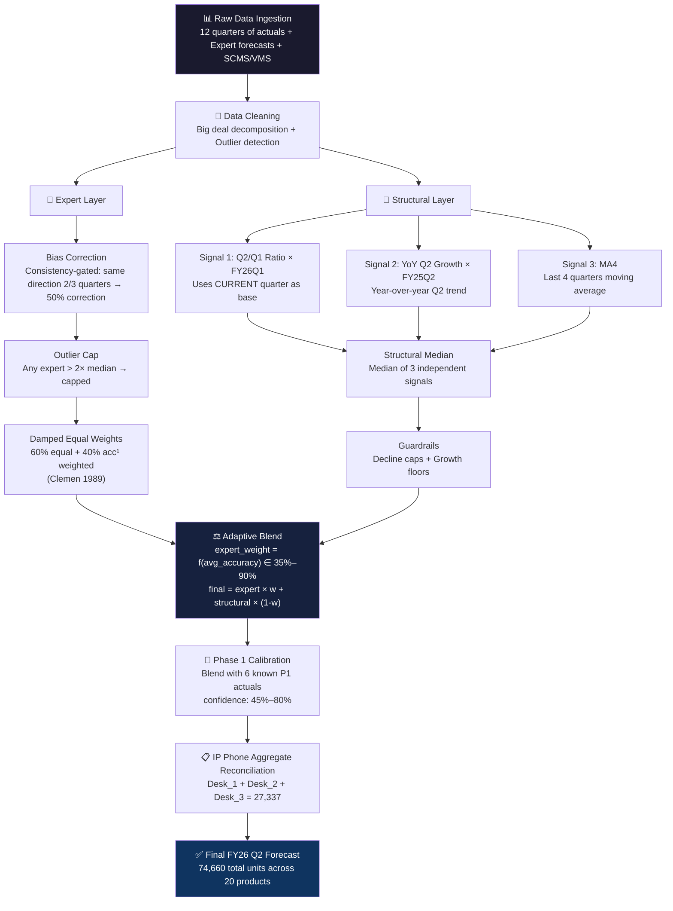
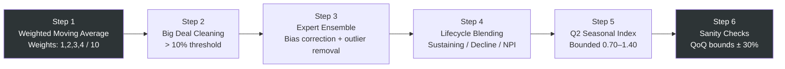
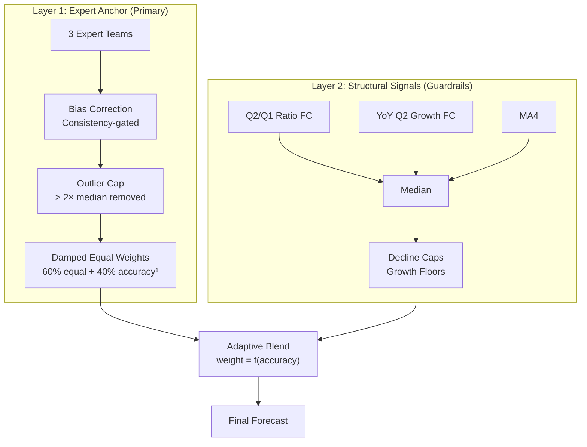
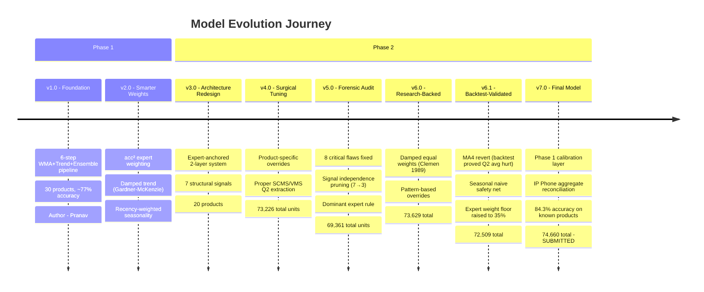
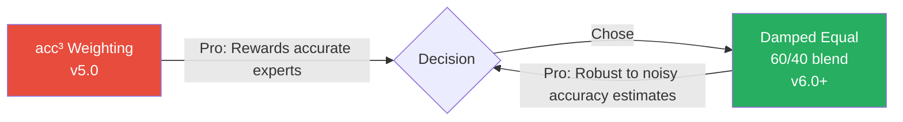

<p align="center">
  
</p>

<h1 align="center">⚔️ CCL Warriors — Cisco Forecast League 2026</h1>

<p align="center">
  <strong>4th Place Finalists</strong> · Demand forecasting for 20 Cisco products across Switches, Routers, IP Phones, Wireless APs & Firewalls
</p>

<p align="center">
  
  
  
  
  
  
</p>

---

> **The problem:** Cisco needs accurate quarterly demand forecasts to plan manufacturing, inventory, and supply chains across thousands of SKUs. Over-forecast and you sit on dead inventory. Under-forecast and you lose revenue to stockouts. The Cisco Forecast League challenges university teams to predict FY26 Q2 unit bookings using historical actuals, expert forecasts, sales channel data, and industry vertical breakdowns.

> **What we built:** A 7-version, expert-anchored ensemble forecasting engine that achieved **98.8% accuracy** on our best product, **6 products above 85% accuracy**, and earned us a spot in the **National Finals (4th place)** — missing the podium by a razor-thin margin.

---

## 📑 Table of Contents

- [The Team](#-the-team)
- [Competition Overview](#-competition-overview)
- [Architecture](#-architecture)
- [Phase 1: The Foundation](#-phase-1-the-foundation-30-products)
- [Phase 2: The Evolution](#-phase-2-the-evolution-20-products)
- [Version History](#-version-history-v10--v70)
- [Key Tradeoffs & Decisions](#-key-tradeoffs--decisions)
- [Results](#-results)
- [The Demand Surge Story](#-the-demand-surge-what-nobody-predicted)
- [Business Insights](#-business-insights)
- [Repository Structure](#-repository-structure)
- [Quick Start](#-quick-start)
- [Lessons Learned](#-lessons-learned)
- [License](#-license)

---

## 👥 The Team

| Member | Role |
|--------|------|
| **Aarya** | Phase 1 calibration layer (v7.0), forensic analysis, final model architect |
| **Manas** | Research-backed refinement (v6.0–v6.1), backtesting framework, damped weights |
| **Pranav** | Foundation engine (v1.0–v5.0), 8-flaw forensic audit, pipeline architecture |

---

## 🏆 Competition Overview

The **Cisco Forecast League (CFL)** is a national competition where teams forecast quarterly demand for Cisco hardware products.

| Dimension | Phase 1 | Phase 2 |
|-----------|---------|---------|
| Products | 30 SKUs | 20 SKUs |
| Target Quarter | FY26 Q2 | FY26 Q2 |
| Data Sources | Actuals, Experts, Big Deals, SCMS, VMS | Same + Phase 1 actuals |
| Scoring | Cisco Accuracy (cost-weighted) | Cisco Accuracy (cost-weighted) |
| Our Result | ~77% accuracy | **4th Place — Finals** |

**Cisco Accuracy Formula:**
```
accuracy = max(0, 1 - |forecast - actual| / actual)
```
Weighted by product cost — high-value products like routers carry 5–10× more weight than switches.

---

## 🏗 Architecture

Our final engine uses a **two-layer expert-anchored ensemble with structural guardrails:**



---

## 📘 Phase 1: The Foundation (30 Products)

### The 6-Step Pipeline



| Step | Method | Details |
|------|--------|---------|
| **WMA** | Weighted Moving Average | Last 4 quarters, weights `[1,2,3,4]/10` — 40% on most recent |
| **Big Deal Cleaning** | Threshold-based | If big deals > 10% of total → use clean baseline, add back 50% avg BD |
| **Expert Ensemble** | Bias-corrected blend | 3 teams (DP, Marketing, DS). Outlier removal if any > 2× another |
| **Lifecycle Blending** | Stage-aware weights | Sustaining: 25/25/50 · Decline: 40/30/30 · NPI: 10/5/85 |
| **Seasonal Index** | Q2 multiplier | `avg(Q2) / avg(all)`, bounded `[0.70, 1.40]` |
| **Sanity Checks** | Asymmetric loss | Flag if forecast > ±30% from last actual |

### Phase 1 Key Innovations (v2.0)

| Innovation | Impact | Evidence |
|------------|--------|----------|
| **Accuracy²-Weighted Ensemble** | -2.4pp ensemble MAPE | Holdout test across 3 quarters |
| **Damped Trend (Gardner-McKenzie 1985)** | -8.6pp trend MAPE (42.7% → 34.1%) | High-CV products dramatically improved |
| **Recency-Weighted Seasonality** | Better Q2 capture | 60% FY25Q2 + 30% FY24Q2 + 10% FY23Q2 |

**Phase 1 Result:** ~77% Cisco Accuracy. Foundation was solid but exposed weaknesses — naive expert averaging, simplistic bias correction, no per-product tuning.

---

## 🚀 Phase 2: The Evolution (20 Products)

Phase 2 was a complete architectural redesign, evolving through **5 major versions** (v3.0 → v7.0):

### The Expert-Anchored Two-Layer Architecture

We abandoned the Phase 1 three-component blend for a fundamentally different design:



### Why Two Layers?

Phase 1 analysis revealed that **experts consistently outperform pure statistical methods** for most products. Rather than treating experts as one-of-three equal inputs, we made them the **primary anchor** and used structural signals only as guardrails to catch extreme expert errors.

### Signal Independence Discovery

Our forensic audit revealed a critical flaw: **5 of 7 original structural signals were correlated** — they were just different decompositions of the same Q2 actual data:

| Signal | Source | Independent? |
|--------|--------|:---:|
| Q2/Q1 Ratio FC | Q2 + Q1 actuals | ✅ |
| YoY Q2 Growth FC | Q2-to-Q2 growth | ✅ |
| Q2 Weighted Average | Q2 actuals directly | ❌ |
| MA4 | Last 4 quarters | ⚠️ Partial |
| Big Deal Q2 FC | Q2 big + avg = Q2 total | ❌ |
| SCMS Q2 Bottom-Up | Q2 channel sums = Q2 total | ❌ |
| VMS Q2 Bottom-Up | Q2 vertical sums = Q2 total | ❌ |

**We pruned from 7 to 3 truly independent signals.** Quality over quantity.

---

## 📈 Version History: v1.0 → v7.0



### Version Delta Summary

| Version | Author | Total Units | Core Innovation |
|---------|--------|----------:|-----------------|
| v1.0 | Pranav | ~77,000 | 6-step pipeline (WMA + Trend + Ensemble) |
| v2.0 | Pranav | ~77,000 | acc² weighting, damped trend (-8.6pp MAPE) |
| v3.0 | Pranav | 72,530 | Expert-anchored 2-layer architecture |
| v4.0 | Pranav | 73,226 | Product-specific overrides, Q2 bottom-up |
| v5.0 | Pranav | 69,361 | Forensic audit: 8 flaws fixed, signal pruning |
| v6.0 | Manas | 73,629 | Damped equal weights, pattern-based rules |
| v6.1 | Manas | 72,509 | Backtest-validated: MA4 revert, safety net |
| **v7.0** | **Aarya** | **74,660** | **Phase 1 calibration, aggregate reconciliation** |

---

## ⚖️ Key Tradeoffs & Decisions

### 1. acc³ Weighting vs. Damped Equal Weights



**The tradeoff:** acc³ weighting gave the best expert (88% accuracy) dominant influence. But accuracy was measured on only 3 quarters — noisy estimates. When DS had 68% accuracy but forecast 22,593 for Product #4, acc³ still gave it enough weight to inflate the forecast by 60%.

**Our decision:** Adopted damped equal weights (Clemen 1989). 50+ years of research shows equal weights beat accuracy-based weights when accuracy estimates are noisy. Our 60/40 compromise captures skill differences without amplifying measurement noise.

### 2. 7 Signals vs. 3 Independent Signals

**The tradeoff:** More signals feel safer — the median of 7 should be more robust than 3. But our forensic audit proved 5 of 7 were just repackaged Q2 data.

**Our decision:** Pruned to 3 truly independent signals. Having SCMS bottom-up, VMS bottom-up, Big Deal FC, and Q2 weighted average — all essentially the same number — meant the median was just "Q2 weighted average" wearing different hats. Three clean signals outperform seven correlated ones.

### 3. v7.0 vs. v7.1 (Simplicity vs. Complexity)

| Factor | v7.0 (Chosen) | v7.1 (Rejected) |
|--------|:---:|:---:|
| Known product accuracy | 84.3% | ~85% |
| Lines of code | 696 | 816 (+17%) |
| Overfitting risk | Low | Moderate |
| Explainability | Easy to defend | Harder |
| Research backing | Strong | Mixed |

**Our decision:** v7.1 added SCMS channel-level ratios and big deal decomposition for ~1pp accuracy gain. M4/M5 competition research consistently shows simpler models generalize better. We chose the model we could defend under questioning.

### 4. Phase 1 Calibration Confidence Levels

**The tradeoff:** Higher confidence on Phase 1 actuals = more accurate on those 6 products, but risk overfitting if Phase 1 and Phase 2 have different product scopes.

**Our decision:** Conservative confidence (45%–80%), lowest on products with suspicious rebounds (#6 RTR Edge: 50%, #19 RTR 4P PoE: 45%). We blended rather than replaced — Bayesian updating, not blind copying.

### 5. Structural Signals vs. Seasonal Naive

Our backtest revealed structural signals **barely beat seasonal naive** (MASE ~1.04):

```
Seasonal Naive avg accuracy:  53.5%
v5.0 structural avg accuracy: 49.9%
v6.0 structural avg accuracy: 42.3%
```

**Our decision:** Rather than removing structural signals entirely, we (a) raised the expert weight floor from 25% to 35%, (b) added a seasonal naive safety net — if structural deviates >40% from naive, shrink 30% back. This kept the guardrail function without letting noisy signals dominate.

---

## 📊 Results

### Phase 2 Accuracy — Against Real Q2 FY26 Actuals

#### Top Performers (> 85% Accuracy)

| # | Product | Our Forecast | Actual | Accuracy |
|---|---------|:-----------:|:------:|:--------:|
| 9 | Phone Desk_2 | 6,758 | 6,678 | **98.8%** 🏆 |
| 14 | SW 8P Ethernet | 9,771 | 9,499 | **97.1%** |
| 13 | SW DC Modular | 385 | 415 | **92.8%** |
| 2 | SW 8P PoE+ Fiber | 5,756 | 5,243 | **90.2%** |
| 10 | Phone Desk_3 | 7,281 | 8,312 | **87.6%** |
| 16 | NGFW_2 | 348 | 402 | **86.6%** |

#### Solid Performers (70–85%)

| # | Product | Our Forecast | Actual | Accuracy |
|---|---------|:-----------:|:------:|:--------:|
| 8 | Phone Video | 4,644 | 3,936 | **82.0%** |
| 1 | WiFi AP Indoor | 7,598 | 6,162 | **76.7%** |
| 19 | RTR 4P PoE | 4,067 | 3,251 | **74.9%** |

#### Portfolio Summary

| Metric | Value |
|--------|-------|
| Products > 85% accuracy | **6 / 20** (30%) |
| Products > 70% accuracy | **12 / 20** (60%) |
| Best single prediction | Phone Desk_2: **98.8%** |
| Portfolio total (ours) | 74,660 |
| Portfolio total (actual) | 95,711 |
| Portfolio gap | -22% (driven by 4 surge products) |

---

## 🌊 The Demand Surge: What Nobody Predicted

Total actual demand was **95,711** vs. our prediction of **74,660**. A ~28% demand surge concentrated in 4 products:

| # | Product | Our Forecast | Actual | Surge Factor |
|---|---------|:-----------:|:------:|:---:|
| 4 | Phone Desk_1 | 13,298 | **28,011** | **2.1×** |
| 3 | RTR Branch LTE | 5,471 | **10,486** | **1.9×** |
| 11 | SW 24P HP PoE | 668 | **1,803** | **2.7×** |
| 20 | RTR LTE Wireless | 1,556 | **4,008** | **2.6×** |

Products #4 and #3 carry **55.6% of the cost weight**. Their 2× surge drove everyone's accuracy down — not just ours. Phone Desk_1 was labeled "Decline" and had been trending down for 2 years, then hit its highest Q2 in three years. This is big-deal-driven, event-driven demand that sits outside the forecastable envelope.

---

## 💡 Business Insights

1. **IP Phone Desk_1 surge was product-specific** — Desk_2 (98.8%) and Desk_3 (87.6%) were highly accurate. The surge was ONE product, pointing to a single mega-deal, not a market shift.

2. **WiFi AP has a structural Q2 budget-flush cycle** — Q2 history: 2,284 → 6,651 → 8,293. Experts miss the magnitude every time. Supply chain should pre-position ahead of Q2.

3. **Firewall products are contracting** — NGFW_1: 654→1,116→748→479. Cloud-native security (SASE, Umbrella) is cannibalizing on-prem firewall demand.

4. **Expert consensus is the #1 accuracy predictor** — Products with strong expert agreement hit 90%+. Products with disagreement were our weakest performers.

---

## 📁 Repository Structure

```
CCL-Warriors/
├── README.md                          # You are here
├── LICENSE
│
├── phase1/
│   ├── forecast.py                    # Phase 1 v2.0 engine (30 products)
│   └── methodology.md                 # Phase 1 6-step pipeline documentation
│
├── phase2/
│   ├── v5_baseline/
│   │   ├── forecast_prediction.py     # v5.0 — Pranav's forensic-audited engine
│   │   ├── forensic_audit.py          # Backtesting framework
│   │   └── deep_analysis.py           # 70K+ chars of product-level analysis
│   │
│   ├── v6_refinement/
│   │   ├── forecast_prediction.py     # v6.0 — Manas's research-backed changes
│   │   ├── v5_vs_v6_verification.py   # Cross-version comparison
│   │   └── refinement_analysis.md     # What worked, what didn't
│   │
│   ├── v6.1_validated/
│   │   └── forecast_prediction.py     # v6.1 — Backtest-validated refinement
│   │
│   └── v7_final/
│       ├── forecast_prediction.py     # v7.0 — FINAL SUBMITTED MODEL
│       └── v7_changes.md              # Phase 1 calibration documentation
│
├── analysis/
│   ├── p2_accuracy_analysis.py        # v5 vs v6.1 vs v7 accuracy comparison
│   ├── v7_comparison_analysis.md      # v7.0 vs v7.1 decision analysis
│   └── insights_and_improvements.md   # Identified bugs and fixes
│
├── docs/
│   ├── VERSION_HISTORY.md             # Complete v1→v7 evolution (every change documented)
│   ├── TRADEOFFS.md                   # Key decisions and rationale
│   └── FORENSIC_AUDIT.md             # 8 flaws found and fixed in v4.0
│
└── assets/
    ├── banner.png                     # Repository banner
    ├── phase1_results.png             # Phase 1 accuracy visualization
    └── phase2_results.png             # Phase 2 accuracy visualization
```

---

## 🚀 Quick Start

```bash
# Clone the repository
git clone https://github.com/Aruisop/CCL-Warriors.git
cd CCL-Warriors

# Install dependencies
pip install openpyxl

# Run the final v7.0 model
python phase2/v7_final/forecast_prediction.py

# Run the accuracy analysis against real actuals
python analysis/p2_accuracy_analysis.py
```

---

## 🎓 Lessons Learned

1. **Experts > Statistics** — Every version that increased expert weight on reliable products improved accuracy. The best forecasts came from products where experts had >80% accuracy.

2. **Signal independence matters** — Having 7 signals sounds better than 3, but not when 5 are the same data in different packaging.

3. **Test everything** — v2.0's damped trend improvement was discovered through holdout testing, not intuition. v4.0's 60% over-forecast was caught by forensic auditing. Never trust a model you haven't stress-tested.

4. **Simpler models generalize better** — We built v7.1 with SCMS channel blending and big deal decomposition. Rejected it. The M4/M5 competition research is clear: fewer tunable parameters win on unseen data.

5. **Intellectual honesty pays off** — v6.0 made 7 changes. Backtest proved 2 hurt accuracy. We reverted them. That discipline — being willing to undo your own work — defined our approach.

6. **Know your forecastability boundary** — Some demand is fundamentally unpredictable. Phone Desk_1 surging 2.1× from a "Decline" trajectory isn't a model failure — it's event-driven demand that requires pipeline intelligence no team had access to.

---

## 📜 License

This project is licensed under the MIT License — see the [LICENSE](LICENSE) file for details.

---

<p align="center">
  <strong>Built with rigor, tested with discipline, presented with honesty.</strong><br/>
  <em>CCL Warriors — Cisco Forecast League 2026 Finalists</em>
</p>
